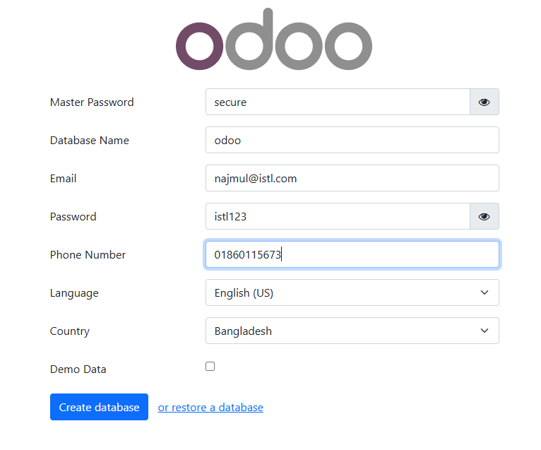

## Odoo: 

Odoo is a powerful open-source ERP (Enterprise Resource Planning) and business management software that helps companies manage their operations efficiently. It provides a suite of integrated applications for various business functions, including CRM, Sales, Inventory, Accounting, HR, Manufacturing, and more. Accessible via a web browser, with an intuitive and modern interface.


### Prerequisites:

- Operating System: Ubuntu, Rocky, Alma, CentOS Stream, or RHEL 8/9
- CPU: 2+ Cores (Recommended 4+ for production)
- RAM: Minimum 2GB (Recommended 4GB+)
- Disk: At least 20GB free space
- SELinux should be disabled
- Python: Python 3.10 or higher.
- PostgreSQL: PostgreSQL 12 or above.
- Node.js and npm: Node.js 12.x or higher and npm for asset management.
- Wkhtmltopdf: A specific version of wkhtmltopdf (0.12.5 or 0.12.6) is required for printing PDF reports.
- Nginx or Apache: For reverse proxying (Nginx is generally preferred).


#### Environments: 

```
hostnamectl set-hostname odoo
```


```
vim /etc/hosts

192.168.10.191  odoo
```


### Install Dependencies:

```
yum install epel-release -y
```


```
yum groupinstall -y "Development Tools"

yum install -y wget curl git gcc make tar unzip yum-utils readline-devel ncurses-devel openssl-devel sqlite-devel tk-devel gdbm-devel bzip2-devel redhat-rpm-config libxslt-devel  openldap-devel libjpeg-devel freetype-devel
```


### Install Python:

_Odoo 17 requires Python 3.10 and above:_

```
yum info platform-python
```


```
yum install python3.11 python3.11-devel python3.11-pip -y
```


```
alternatives --list
```


```
python3 --version

Python 3.11.11
```


```
pip3.11 install virtualenv
```


### Install Node.js:


```
dnf module list nodejs

dnf module reset nodejs -y

dnf module install nodejs:18 -y
```


```
node --version

v18.20.4
```


_Install rtlcss node module using npm:_

```
npm install -g rtlcss
```


_Also install Less and Less Plugin Clean CSS:_

```
npm install -g less less-plugin-clean-css
```


### Install wkhtmltopdf:


#### RHEL 8 based systems:

```
wget https://github.com/wkhtmltopdf/packaging/releases/download/0.12.6.1-2/wkhtmltox-0.12.6.1-2.almalinux8.x86_64.rpm


dnf install -y ./wkhtmltox-0.12.6.1-2.almalinux8.x86_64.rpm
```


```
wkhtmltopdf --version

wkhtmltopdf 0.12.6.1 (with patched qt)
```


### Install and Configure PostgreSQL:

_To install the library:_

```
dnf install -y postgresql-libs
```


```
psql
psql -U postgres -d postgres

SHOW config_file;
SHOW hba_file;
```


```
CREATE USER odoo WITH ENCRYPTED PASSWORD 'odoo';

ALTER USER odoo WITH ENCRYPTED PASSWORD 'odoo123';

ALTER USER odoo CREATEDB;
```


```
//create database odoo;

//GRANT ALL PRIVILEGES ON DATABASE odoo TO odoo;
```


### Install Odoo:


_Create a new system user for managing the Odoo processes on the Odoo server:_

```
useradd -m odoo
```


```
su - odoo
```


_Clone Odoo’s Github repository locally:_

```
git clone https://github.com/odoo/odoo.git --depth 1 --branch 17.0 --single-branch
```


_Use `virtualenv` command to create python virtual environment for Odoo ERP:_

```
virtualenv odoo17-venv

source odoo17-venv/bin/activate

pip3.11 install --upgrade pip

pip3.11 install wheel

pip3.11 install psycopg2-binary urllib3 werkzeug pytz passlib

pip3.11 install -r odoo/requirements.txt

pip3.11 list

deactivate
```


_Create directory on git clone directory:_

```
mkdir odoo/custom-addons
```


#### Configure Odoo:

The `odoo.conf` file contains key configurations required for Odoo to run properly:

```
vim /etc/odoo17.conf

[options]
admin_passwd = secure
db_host = 192.168.10.191
db_port = False
db_user = odoo
db_password = odoo
addons_path = /home/odoo/odoo/addons, /home/odoo/odoo/custom-addons
xmlrpc_port = 8069
default_productivity_apps = True

```


```
chown odoo:odoo /etc/odoo17.conf
```


### Create an Odoo Service File:


```
mkdir -p /var/log/odoo
chown odoo:odoo /var/log/odoo
chmod 755 /var/log/odoo
```


```
vim /etc/systemd/system/odoo.service

[Unit]
Description=Odoo17
After=network.target

[Service]
Type=simple

SyslogIdentifier=odoo17
PermissionsStartOnly=true

User=odoo
Group=odoo

ExecStart=/home/odoo/odoo17-venv/bin/python3.11 /home/odoo/odoo/odoo-bin -c /etc/odoo17.conf \
        --logfile /var/log/odoo/odoo.log

StandardOutput=journal+console

[Install]
WantedBy=multi-user.target

```


```
systemctl daemon-reload
systemctl start odoo
systemctl status odoo
```


### Access Odoo:

Open a browser and go to: `http://<server_ip>:8069`

Login Email: your@email.com  
Password: istl123




### Links:

- [Install Odoo 17 on Rocky](https://computingforgeeks.com/install-odoo-epr-on-rocky-almalinux-rhel-centos/)
- [Install Odoo 17](https://erp.primacyinfotech.com/blog/odoo-7/how-to-install-odoo-17-on-almalinux-8-or-rocky-linux-8-or-centos-8-32)
- [Install Odoo 17 ERP Software](https://www.howtoforge.com/how-to-install-odoo-17-erp-software-on-rocky-linux-9/)
- [Install Odoo](https://www.atlantic.net/dedicated-server-hosting/how-to-install-odoo-14-erp-on-rocky-linux-8/)

