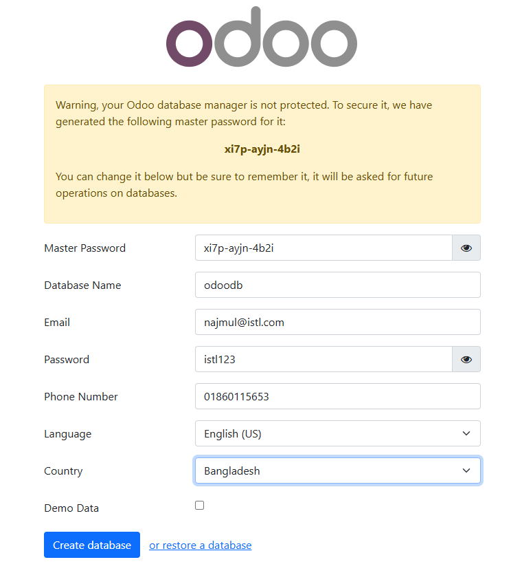

## Odoo in a Docker:

To install Odoo in a Docker container with an external database (e.g., PostgreSQL running on another machine), follow these steps:


### Configure PostgreSQL:

Ensure you have a PostgreSQL server running on a separate machine.

_Create a user for Odoo:_

```
CREATE USER odoo WITH ENCRYPTED PASSWORD 'odoo';

ALTER USER odoo CREATEDB;
```


### To run Odoo container using docker run:

```
mkdir odoo_data
```


```
docker run --name odoo -dit -v ./odoo_data:/var/lib/odoo -p 8069:8069 \
--user odoo \
-e HOST=192.168.10.191 \
-e USER=odoo \
-e PASSWORD=odoo \
--network host \
odoo:17
```


### Create a Docker Compose File:

Create a `docker-compose.yaml` file:

```
services:
  odoo:
    image: odoo:17
    container_name: odoo
    restart: always
    ports:
      - "8069:8069"
    volumes:
      - ./odoo_data:/var/lib/odoo
    environment:
      - HOST=192.168.10.191  # Replace with your external database host IP
      - USER=odoo
      - PASSWORD=odoo
    user: odoo  # Use the username instead of UID:GID
    network_mode: host  # Use host networking if your DB is on the same machine or reachable via the host

```


```
docker compose -f docker-compose.yaml config
```


```
docker-compose up -d
```


`Note`: ! odoo Published ports are discarded when using host network mode

When you use the `host` network mode in Docker, **published ports are ignored** because the container uses the host's networking directly. This means the container doesn't need to map ports since it can use the host's network interface directly.


#### Check Correct Ownership:

Run the following command to check the owner of `/var/lib/odoo` inside the container:

```
docker exec -it odoo ls -l /var/lib/odoo
```


```
docker exec -it odoo bash
```


```
id

uid=101(odoo) gid=101(odoo) groups=101(odoo)
```


#### Fix Volume Permissions on the Host: 

If you are using a bind mount (`-v ./odoo_data:/var/lib/odoo`) run:

```
chown -R 101:101 odoo_data
chmod -R 775 odoo_data/
```


```
docker restart odoo
```


```
docker logs -f odoo
```


### Access Odoo: 
Open your browser and go to: `http://your_server_ip:8069` and setup process and enter the external database details.





